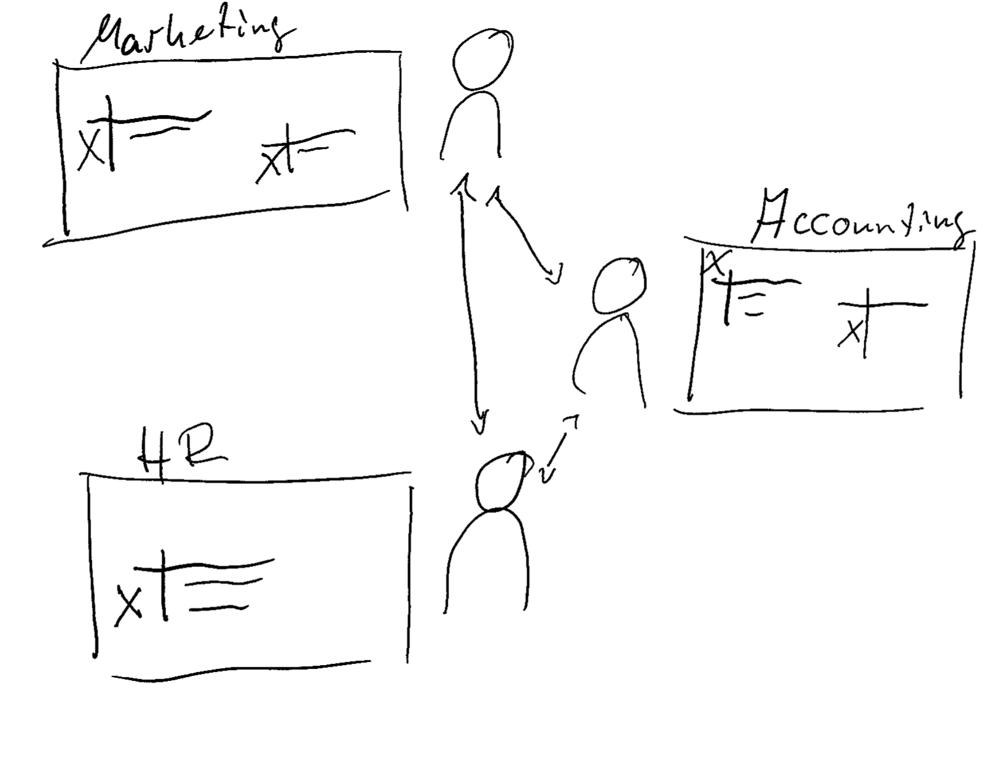
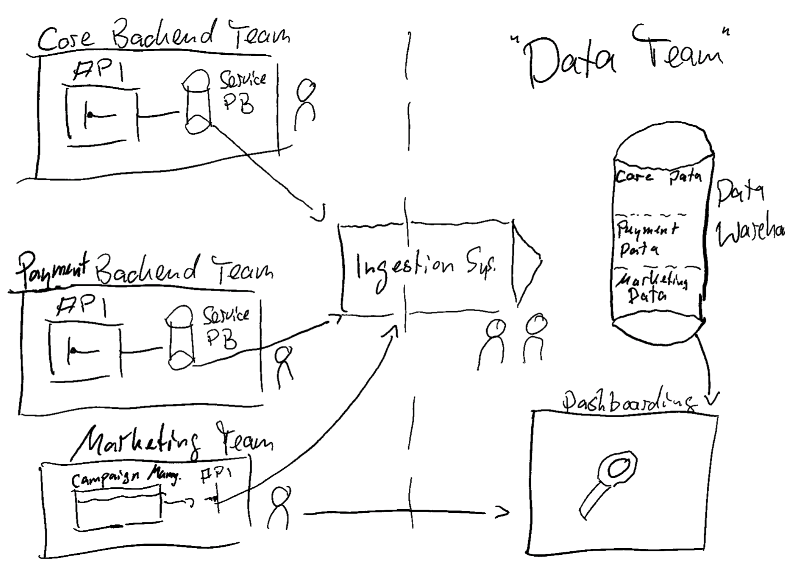
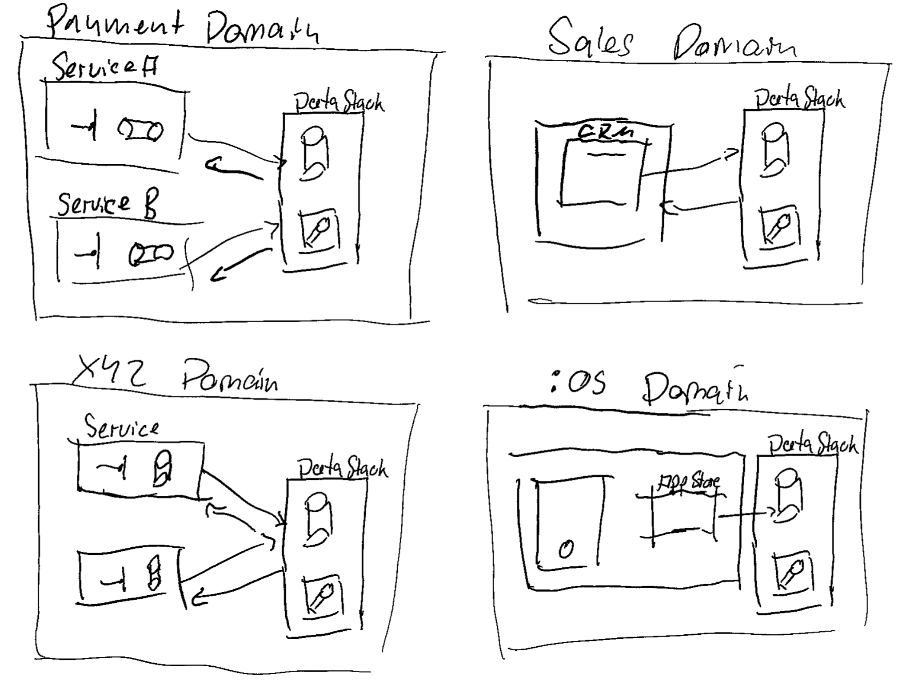

# The Evolution of Data Orgs

!!! note "Disclaimer"
    
    I am sketching a totally artificial and simplified evolution of stages for data in organisations. The goal is to show the different phases of data engineering and the different challenges that come with it.

=== "Small Orgs - No Data Person"
    - Analytical needs are solved via direct communication
    - Data is stored in a decentralized fashion, mostly in spreadsheets

    

=== "Small Orgs - One Data Person"
    - Identified need for bringing data together and analyzing aggregates of it
    - One centralized storage is set up
    - Data is exported manually and imported into a central storage. Often still file based.
    - The standardization is often driven from the cost side (e.g. Analyzing Marketing)

    

=== "Small/Mid Tech Orgs"
    - Tech Teams having their own databases to fullfill operations
    - Data is already structured and can be retrieved from databases or APIs

    

=== "Decentralized Tech Orgs"
    - Multiple Tech and Non Tech Domains having different data needs
    - Data is not used for analytical purposes only.
    - Products are build on top of data. Circular dependency between data and product.
    - Teams own their own data pipelines and storage.

    
