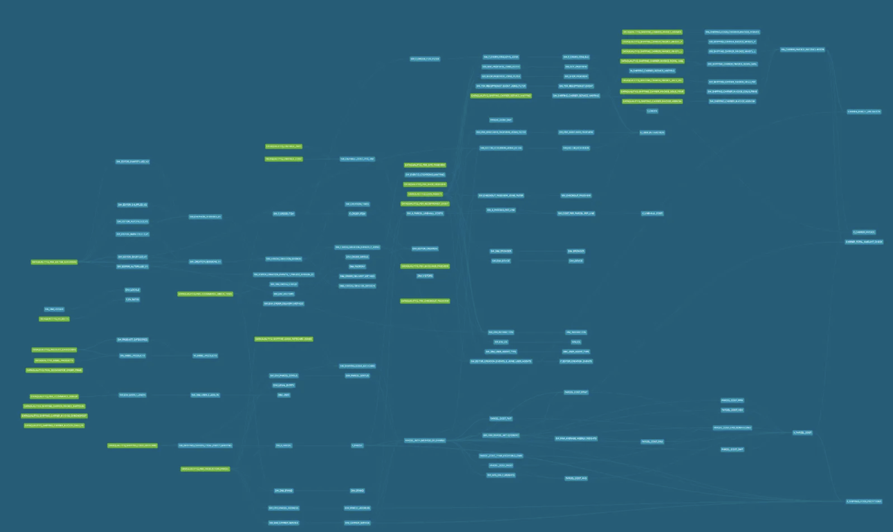

## From Raw to Insight

As mentioned before, there are certain types of data transformations like **cleaning** data, **joining** and **aggregating** it.

In a data workflow, it makes sense to seperate these kind of operations and think in so called **transformation layers**. 

A typical layer architecture might look like this:

| Layer    | Example Operations                   |
|----------|--------------------------------------|
| RAW      | -                                    |
| STAGING  | deduplicate data & rename columns    |
| MART     | combine tables & create calculations |
| ANALYSIS | aggregate tables & create metrics    |

Let's take a look at an example:

=== "RAW"
    *"Oh no! There is a duplicate!"*

    | pokemon_id | pokemon_name |
    |------------|--------------|
    | 1          | Bulbasaur    |
    | 2          | Ivysaur      |
    | 2          | Ivysaur      |
    | 3          | Venusaur     |

=== "STAGING"
    *"That looks much nicer. Now add some more data!"*

    | pokemon_id | pokemon_name |
    |------------|--------------|
    | 1          | Bulbasaur    |
    | 2          | Ivysaur      |
    | 3          | Venusaur     |

=== "MART"
    *"Cool! I joined my donation data."*

    | pokemon_id | pokemon_name | number_of_pokemon | amount_donated |
    |------------|--------------|-------------------|----------------|
    | 1          | Bulbasaur    | 10                | 100.00         |
    | 2          | Ivysaur      | 20                | 200.00         |
    | 3          | Venusaur     | 5                 | 50.00          |

=== "ANALYSIS"
    *"Wow! So many Pokemon donated! I have to share this with my friends."*

    | number_of_pokemon | amount_donated | average_donation |
    |-------------------|----------------|------------------|
    | 35                | 350            | 10.00            |

!!! Note "Using layers keeps your workflow structured!"

## Using SQL to take care of transformations 

One of the preferred ways of encoding transformation logic in the data world is **SQL**. 

As mentioned before, **SQL** is a very powerful and easy to learn language. So it makes sense to also use it for our transformations.

Typically, we would write different SQL statements with different kind of transformations and execute them in the correct order:

 

```mermaid
flowchart LR
    SA(Raw Table A) --- Q1[SQL]
    Q1 --> T1([Table 1])

    SB(Raw Table B) --- Q2[SQL]
    Q2 --> T2([Table 2])

    T1 --- Q[SQL]
    T2 --- Q
    Q --> T3([Table 3])
```

 

As you can imagine, this can get quite complex and hard to maintain. Especially if you have many different raw tables and transformations.

Some day your **data lineage** might look like this (each bubble represents a table):

But worry no longer, there is a solution for this problem: **[DBT](https://www.getdbt.com/)**