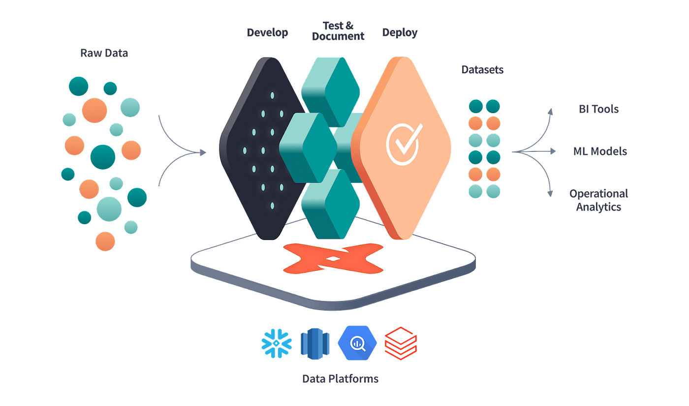

## DBT - Data Build Tool

**[DBT](https://www.getdbt.com/)** is a tool, which helps us to manage our data transformation logic. 



Everything you need are some `.sql` files, that hold your transformation logic, and DBT takes then care of the rest.

While DBT has a lot of features, we want to highlight some of them here:

- **LINEAGE**
    
    DBT has knowledge of your data lineage and knows what comes first and what next. It executes your files in the correct order.

- **TESTING**

    You can define and write tests and make sure, that your data quality is always at its best.

- **DOCUMENTATION**

    By adding column descriptions in your code, you can make sure, that everyone is one the same page about your data.

- **JINJA** 

    DBT facilitates the use of the DRY principle (*Don't Repeat Yourself*) by using `jinja templating`.


??? note "One word on the DRY principle (aka *jinja templating*)."

    DBT enables the use of *jinja templating*. This means, that you can use **variables** and **loops** in your SQL statements.

    This is especially useful, if you have to repeat the same logic over and over again.

    Here is an example:

    ```sql
    -- This is a jinja variable
    -- -- -- -- -- -- -- -- -- -- -- -- -- -- -- -- -- -- -- -- -- -- -- -- 
    

    -- This is a jinja loop
    -- -- -- -- -- -- -- -- -- -- -- -- -- -- -- -- -- -- -- -- -- -- -- -- 
    SELECT 
        
            item ,
        
    FROM 
        my_schema.my_table

    -- This compiles to this:
    -- -- -- -- -- -- -- -- -- -- -- -- -- -- -- -- -- -- -- -- -- -- -- -- 
    SELECT 
        column_a, 
        column_b, 
        column_c
    FROM
        my_schema.my_table
    ```

    More on that here: **[DBT Macros](https://docs.getdbt.com/docs/build/jinja-macros)**